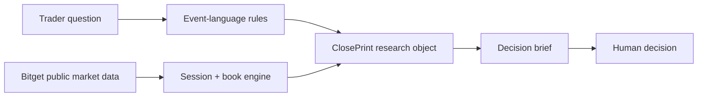

# Veyra

Veyra is a no-login, read-only research desk for Bitget rToken traders. Its ClosePrint workflow answers one narrow question: when an event lands while the US cash market is closed, what does the current rToken book already reflect—and what could change when the underlying market reopens?

**Track:** AI Trading Desk

**Sub-theme:** Information Extraction & Signal Generation

**Live demo:** https://veyraa-rust.vercel.app/

**Status:** public hackathon demo; no order execution

## The research task

A trader supplies an event packet, rToken, direction and size. Veyra returns:

1. A bounded event-language read.
2. Two market clocks: the rToken venue and the US cash session.
3. Visible-book spread, fill ratio and modeled impact.
4. Three explicitly modeled Monday re-anchor sensitivity cases.
5. An actionable research posture and its invalidation conditions.

The public demo never labels illustrative values as live, never invents a consensus figure or historical analogue, and never places an order.

## Data and computation

| Layer | Source | Label |
| --- | --- | --- |
| rToken ticker, book and candles | Public Bitget v3 market endpoints | `live` when available |
| Fallback market snapshot | Fixed demo fixture | `illustrative` |
| US-session venue anchor | Latest completed 3–4 PM New York hourly rToken candle | `derived` |
| Event text | Seeded demo packet or user input | `illustrative` / `user-supplied` |
| Spread, fill and impact | Deterministic TypeScript | `derived` |
| Re-anchor cases | −3%, 0%, +3% around the venue anchor | `modeled` |

The live UI currently uses deterministic language extraction and market math. The broken Qwen subsidy dependency was removed from the judge-facing path, so an unavailable credential cannot break the demo. No external runtime LLM is claimed in this version.

## Architecture



## Local development

Requirements: Node.js 22.13 or newer.

```bash
npm install
npm run dev
```

Useful checks:

```bash
npm run lint
npm run build
```

No API key is required for the public demo path.

## Honest limitations

- The fallback order books are illustrative.
- The venue anchor is not the official underlying-stock close.
- No historical weekend-to-Monday probability is claimed.
- No transcript or source authenticity verification is performed.
- Fees, taxes, hidden liquidity, issuer redemption and account state are excluded.
- Veyra does not connect to a brokerage or place orders.

## Submission materials

- [Submission draft](docs/SUBMISSION.md)
- [90-second demo script](docs/DEMO_SCRIPT.md)
- [Validation plan](docs/VALIDATION.md)
- [Spectrum UI source record](SPECTRUM-SOURCES.md)

## Component sources

The interface uses Spectrum UI's Agent Steps and Floating Label Input, plus compatible local shadcn primitives. Source and license details are recorded in [SPECTRUM-SOURCES.md](SPECTRUM-SOURCES.md).

## Safety

Research only. Veyra provides structured evidence and sensitivity analysis, not investment advice.
